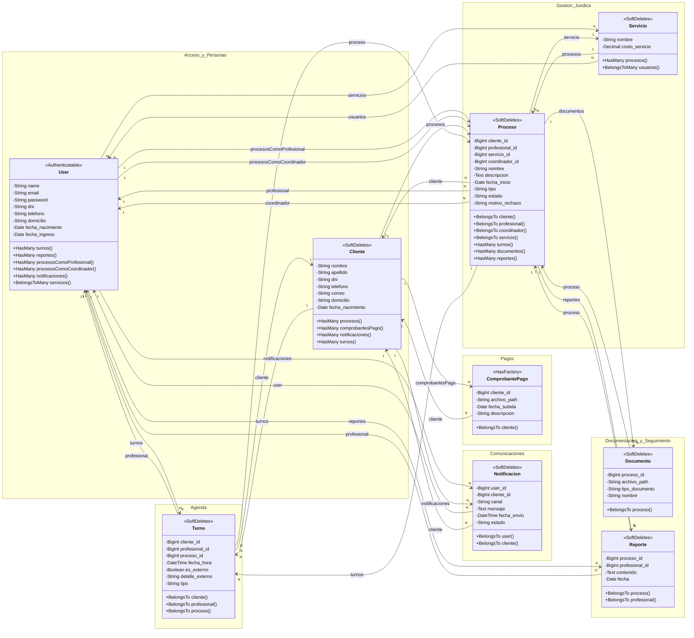

# Diagrama de Clases - Modelos de Dominio

## Sistema de Gestión de Turnos y Procesos

## Módulos del Diagrama

- **Acceso y Personas**: agrupa usuarios internos del sistema y clientes del estudio.
- **Gestión Jurídica**: concentra procesos legales y servicios ofrecidos.
- **Agenda**: contiene los turnos internos, seguimientos y eventos externos.
- **Documentación y Seguimiento**: reúne documentos del expediente y reportes profesionales.
- **Pagos**: registra comprobantes asociados a clientes.
- **Comunicaciones**: modela las notificaciones enviadas a usuarios y clientes.

## Descripción de Relaciones

### User (Profesional/Coordinador)
- `turnos()` → Turno[] : Un usuario puede tener muchos turnos
- `reportes()` → Reporte[] : Un usuario puede generar muchos reportes
- `procesosComoProfesional()` → Proceso[] : Un usuario puede ser profesional de muchos procesos
- `procesosComoCoordinador()` → Proceso[] : Un usuario puede ser coordinador de muchos procesos
- `notificaciones()` → Notificacion[] : Un usuario puede recibir muchas notificaciones
- `servicios()` → Servicio[] : Un usuario profesional puede estar asociado a muchos servicios

### Cliente
- `procesos()` → Proceso[] : Un cliente puede tener muchos procesos
- `comprobantesPago()` → ComprobantePago[] : Un cliente puede tener muchos comprobantes
- `notificaciones()` → Notificacion[] : Un cliente puede recibir muchas notificaciones
- `turnos()` → Turno[] : Un cliente puede tener muchos turnos

### Proceso
- `cliente()` → Cliente : Un proceso pertenece a un cliente
- `profesional()` → User : Un proceso tiene un profesional asignado
- `coordinador()` → User : Un proceso tiene un coordinador asignado
- `servicio()` → Servicio : Un proceso ofrece un servicio
- `turnos()` → Turno[] : Un proceso puede tener muchos turnos
- `documentos()` → Documento[] : Un proceso puede tener muchos documentos
- `reportes()` → Reporte[] : Un proceso puede tener muchos reportes

### Servicio
- `procesos()` → Proceso[] : Un servicio puede estar en muchos procesos
- `usuarios()` → User[] : Un servicio puede estar asociado a muchos usuarios profesionales

### Turno
- `cliente()` → Cliente : Un turno pertenece a un cliente
- `profesional()` → User : Un turno tiene un profesional asignado
- `proceso()` → Proceso : Un turno puede pertenecer a un proceso

### Documento
- `proceso()` → Proceso : Un documento pertenece a un proceso

### Reporte
- `proceso()` → Proceso : Un reporte pertenece a un proceso
- `profesional()` → User : Un reporte es creado por un profesional

### Notificacion
- `user()` → User : Una notificación pertenece a un usuario
- `cliente()` → Cliente : Una notificación puede pertenecer a un cliente

### ComprobantePago
- `cliente()` → Cliente : Un comprobante pertenece a un cliente

## Notas de Implementación

- **SoftDeletes**: Todos los modelos (excepto ComprobantePago) implementan SoftDeletes para eliminación lógica
- **HasFactory**: Todos los modelos tienen factories asociadas para testing
- **Auditable**: User implementa Auditable de OwenIt para auditoría de cambios
- **HasRoles**: User usa Spatie Permission para gestión de roles y permisos
- **Casts**: Los campos de fecha/fecha_hora están casteados correctamente
- **Fillable**: Todos los campos editables están definidos en $fillable
